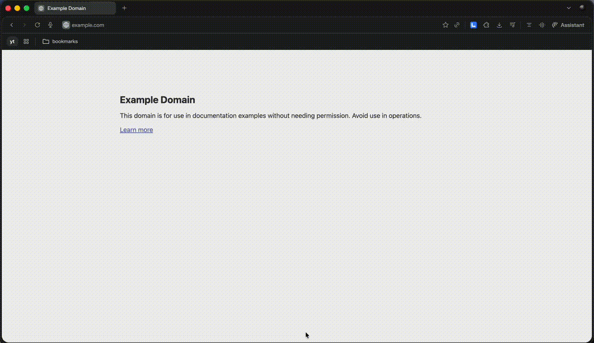

# Local-Agent Ollama



[](https://chromewebstore.google.com/detail/local-agent-ollama/mkhiohkkekffefiggoijacbgcpdfmlfp?authuser=0&hl=en)
[]()
[](https://github.com/ollama/ollama)

A private, local AI browser extension powered by [Ollama](https://ollama.com). Chat with any webpage, summarize tabs, and automate browser tasks — fully on your machine, no data sent to the cloud.

## Features

- **Chat** — ask questions about any open tab using `@tabname`
- **Agent mode** — AI can navigate, click, type, and read pages autonomously
- **Fully private** — runs entirely on your machine via Ollama
- **Tool calling** — uses Ollama's native tool calling for capable models (recommended: 70B+)

## Requirements

- [Ollama](https://ollama.com) running locally
- Chrome 116+

## Installation

1. Clone or download this repo
2. Open Chrome and go to `chrome://extensions`
3. Enable **Developer mode** (top right)
4. Click **Load unpacked** and select the repo folder
5. Start Ollama: `ollama serve`

> If Ollama blocks requests from the extension, restart it with:
> ```bash
> OLLAMA_ORIGINS="*" ollama serve
> ```

## Usage

- Click the extension icon or press `Cmd+E` to open the side panel
- Select a model from the dropdown
- **Chat mode** — type a message, use `@tabname` to reference any open tab
- **Agent mode** — enable Agent, then describe a task for the AI to complete in your browser

## File Structure

```
manifest.json              — Extension manifest (MV3)
service-worker-loader.js   — Background service worker, Ollama API, agent loop
content.js                 — Content script: accessibility tree, tool execution
sidepanel.html/css/js      — Side panel UI
assets/                    — Content scripts injected into pages
```
